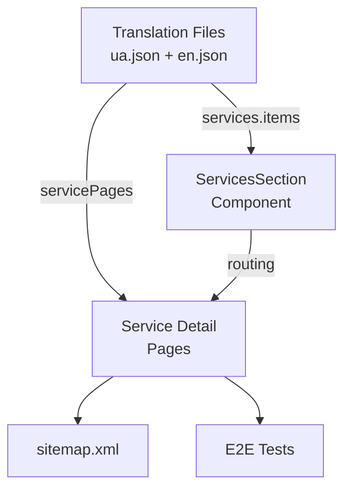
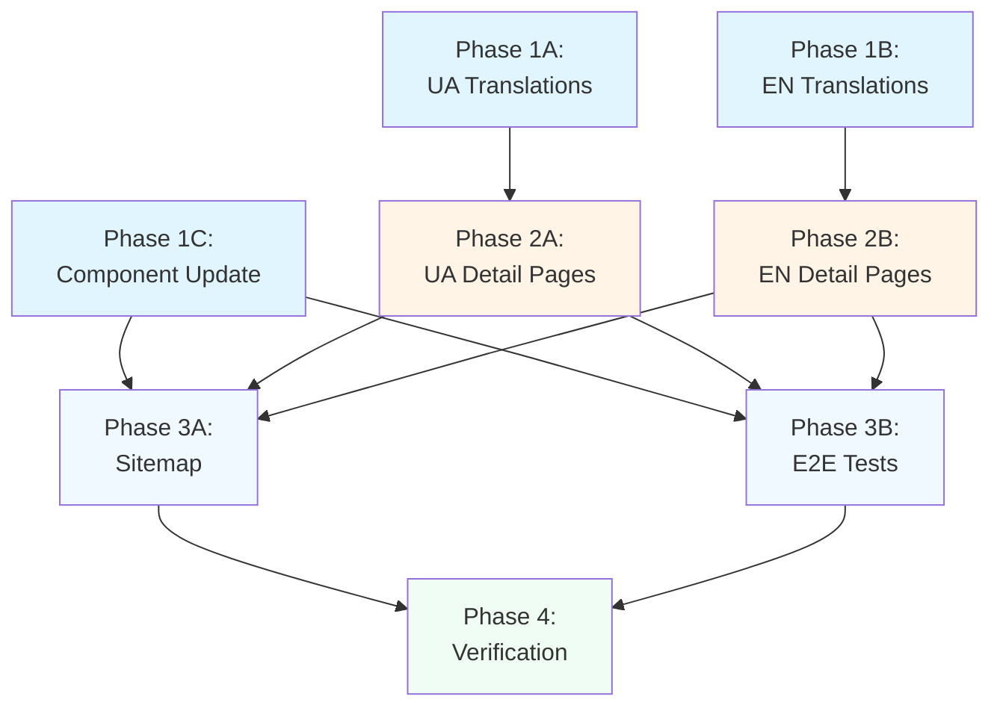

# Add Two New Services to [Mission101.ai](http://Mission101.ai)

## Current State

The Mission101.ai website currently has 6 services displayed in the services section:

1. Voice Agents for Call Centers (`voice-agents`)
2. Personal AI Assistants (`ai-assistants`)
3. Custom AI Solutions (`custom-ai-solutions`)
4. Marketing Automation (`marketing-automation`)
5. AI-Generated Business Websites (`ai-websites`)
6. Business Monitoring & Analytics (`business-analytics`)

**Existing files:**

- [src/i18n/locales/ua.json](src/i18n/locales/ua.json) - Ukrainian translations (services.items array at line 68)
- [src/i18n/locales/en.json](src/i18n/locales/en.json) - English translations (services.items array at line 68)
- [src/components/sections/ServicesSection.tsx](src/components/sections/ServicesSection.tsx) - Services component with icons and routing
- [public/sitemap.xml](public/sitemap.xml) - Sitemap with existing service pages
- [e2e/hash-navigation.spec.ts](e2e/hash-navigation.spec.ts) - E2E tests for service page navigation

**Pain points:**

- New services need to be added at the **beginning** of the list (positions 1-2)
- All existing services must shift to positions 3-8
- Need full i18n support (UA + EN)
- Need dedicated detail pages with 4 features each
- Need sitemap entries for SEO
- Need e2e test coverage

## Goal

Add two new services to the beginning of the services list:

1. **Побудова стратегії цифрової трансформації компанії** / **Digital Transformation Strategy**
2. **Тренінги та навчання співробітників** / **Employee Training & Education**

Each service needs:

- Main listing translations (title + 2 description points)
- Icons (`Workflow`, `GraduationCap`) and slugs
- Detailed service pages with 4 features
- Sitemap entries (EN + UA)
- E2E test coverage

The new services will help Mission101.ai showcase their strategic consulting and training capabilities alongside technical implementation services.

## Architecture

### Services Section Structure

```mermaid
graph LR
    subgraph Current["Current State (6 services)"]
        S1[Voice Agents]
        S2[AI Assistants]
        S3[Custom AI]
        S4[Marketing]
        S5[Websites]
        S6[Analytics]
    end
    
    subgraph Target["Target State (8 services)"]
        N1[Digital Transformation]
        N2[Employee Training]
        S1b[Voice Agents]
        S2b[AI Assistants]
        S3b[Custom AI]
        S4b[Marketing]
        S5b[Websites]
        S6b[Analytics]
    end
    
    Current --> Target
```




### Data Flow




## Key Decisions Summary


| Decision          | Options Considered   | Choice                                                 | Rationale                                                    |
| ----------------- | -------------------- | ------------------------------------------------------ | ------------------------------------------------------------ |
| Service order     | Append vs Prepend    | **Prepend** (add at beginning)                         | User explicitly requested new services at the start          |
| Icons             | Various Lucide icons | `Workflow` + `GraduationCap`                           | Best semantic match for transformation strategy and training |
| Slugs             | Various formats      | `digital-transformation-strategy`, `employee-training` | Consistent with existing kebab-case pattern                  |
| Detail page depth | 2-6 features         | **4 features**                                         | Matches existing service pages pattern                       |
| Color gradients   | Various combinations | Add 2 new gradients at start                           | Maintain visual consistency with existing services           |
| Sitemap placement | Various positions    | After Uzhhorod pages, before existing services         | Logical grouping by content type                             |


## Dependency Graph




**Parallelization strategy:**

- Phase 1: All 3 subagents run in parallel (different files)
- Phase 2: 2 subagents run in parallel (different files)
- Phase 3: 2 subagents run in parallel (different files)
- Phase 4: Single verification subagent

## Execution Protocol

1. **Subagents never mark their own todos complete.** Report results to master agent.
2. **Master agent delegates all work.** No direct execution by master.
3. **Master tracks progress in YAML frontmatter.** Update before/after each subagent.
4. **Verification is delegated.** Launch separate verification subagent after implementation.
5. **Phase-level verification.** After all subagents in phase complete, run cross-check.
6. **Phase gating.** A phase cannot start until all dependencies are `completed`.
7. **Human approval required.** Master presents phase summary and waits for "go ahead".
8. **Context efficiency.** Master minimizes direct tool usage, delegates to subagents.

## PHASE 1A -- Add UA Service Entries (parallel with 1B, 1C)

**Goal**: Add 2 new service entries at the beginning of the Ukrainian services.items array.

**Subagent**: generalPurpose

**Inputs**: None (Phase 1)

**Tasks**:

1. Read `src/i18n/locales/ua.json` to understand the current structure
2. Insert 2 new service objects at the **beginning** of `services.items` array (line 68)
3. Service 1: "Побудова стратегії цифрової трансформації компанії"
  - Title: Clear Ukrainian translation
  - Description: Array of 2 points covering strategy assessment and implementation planning
4. Service 2: "Тренінги та навчання співробітників"
  - Title: Clear Ukrainian translation
  - Description: Array of 2 points covering custom training programs and hands-on workshops
5. Follow the exact structure of existing services (title + description array)

**Files created/modified**:

- src/i18n/locales/ua.json (modified)

**Verification**:

```bash
# Verify JSON is valid
cat src/i18n/locales/ua.json | jq '.services.items | length' # Should be 8
cat src/i18n/locales/ua.json | jq '.services.items[0].title' # Should be new service 1
cat src/i18n/locales/ua.json | jq '.services.items[1].title' # Should be new service 2
```

## PHASE 1B -- Add EN Service Entries (parallel with 1A, 1C)

**Goal**: Add 2 new service entries at the beginning of the English services.items array.

**Subagent**: generalPurpose

**Inputs**: None (Phase 1)

**Tasks**:

1. Read `src/i18n/locales/en.json` to understand the current structure
2. Insert 2 new service objects at the **beginning** of `services.items` array (line 68)
3. Service 1: "Digital Transformation Strategy"
  - Title: Professional English translation
  - Description: Array of 2 points covering comprehensive roadmaps and technology selection
4. Service 2: "Employee Training & Education"
  - Title: Professional English translation
  - Description: Array of 2 points covering upskilling programs and practical workshops
5. Follow the exact structure of existing services (title + description array)

**Files created/modified**:

- src/i18n/locales/en.json (modified)

**Verification**:

```bash
# Verify JSON is valid
cat src/i18n/locales/en.json | jq '.services.items | length' # Should be 8
cat src/i18n/locales/en.json | jq '.services.items[0].title' # Should be new service 1
cat src/i18n/locales/en.json | jq '.services.items[1].title' # Should be new service 2
```

## PHASE 1C -- Update ServicesSection Component (parallel with 1A, 1B)

**Goal**: Add icons, slugs, and color gradients to ServicesSection component for the 2 new services.

**Subagent**: generalPurpose

**Inputs**: None (Phase 1)

**Tasks**:

1. Read `src/components/sections/ServicesSection.tsx` to understand the current structure
2. Import `Workflow` and `GraduationCap` icons from `lucide-react`
3. Add these icons at the **beginning** of `serviceIcons` array (line 7):
  - `Workflow` for digital transformation strategy
  - `GraduationCap` for employee training
4. Add slugs at the **beginning** of `serviceSlugs` array (line 8):
  - `'digital-transformation-strategy'`
  - `'employee-training'`
5. Add 2 new color gradients at the **beginning** of `accentColors` array (line 30-36):
  - Use distinctive gradients that don't conflict with existing ones
  - Suggestion: `'from-violet-500 to-purple-500'` and `'from-sky-500 to-blue-500'`
6. Ensure arrays maintain proper order (new services first, then existing 6)

**Files created/modified**:

- src/components/sections/ServicesSection.tsx (modified)

**Verification**:

```bash
# Verify imports
grep "Workflow" src/components/sections/ServicesSection.tsx
grep "GraduationCap" src/components/sections/ServicesSection.tsx
# Verify arrays have 8 items
grep "serviceIcons = \[" -A 1 src/components/sections/ServicesSection.tsx
grep "serviceSlugs = \[" -A 1 src/components/sections/ServicesSection.tsx
```

## PHASE 2A -- Add UA Service Detail Pages (depends on 1A)

**Goal**: Add detailed service page translations for both new services in Ukrainian.

**Subagent**: generalPurpose

**Inputs**: Phase 1A complete (needs service structure from ua.json)

**Tasks**:

1. Read existing service detail pages in `src/i18n/locales/ua.json` (lines 281-376) to understand structure
2. Add entry for "digital-transformation-strategy" to `servicePages` object:
  - slug: `digital-transformation-strategy`
  - title: Ukrainian translation
  - subtitle: Brief tagline
  - description: 3-4 paragraphs covering:
    - What digital transformation strategy entails
    - Current state assessment and future planning
    - Integration with existing systems
    - Long-term competitive advantage
  - features: Array of 4 benefits (e.g., "Комплексна оцінка", "Поетапне впровадження", "Вибір технологій", "Вимірювані KPI")
  - seo: title and description meta tags
3. Add entry for "employee-training" to `servicePages` object:
  - slug: `employee-training`
  - title: Ukrainian translation
  - subtitle: Brief tagline
  - description: 3-4 paragraphs covering:
    - Importance of training in AI adoption
    - Custom programs for business needs
    - Hands-on workshops and exercises
    - Ongoing support and mentorship
  - features: Array of 4 benefits (e.g., "Індивідуальна програма", "Практичні вправи", "Реальні кейси", "Постійна підтримка")
  - seo: title and description meta tags

**Files created/modified**:

- src/i18n/locales/ua.json (modified)

**Verification**:

```bash
# Verify new entries exist
cat src/i18n/locales/ua.json | jq '.servicePages."digital-transformation-strategy".title'
cat src/i18n/locales/ua.json | jq '.servicePages."employee-training".title'
cat src/i18n/locales/ua.json | jq '.servicePages."digital-transformation-strategy".features | length' # Should be 4
cat src/i18n/locales/ua.json | jq '.servicePages."employee-training".features | length' # Should be 4
```

## PHASE 2B -- Add EN Service Detail Pages (depends on 1B)

**Goal**: Add detailed service page translations for both new services in English.

**Subagent**: generalPurpose

**Inputs**: Phase 1B complete (needs service structure from en.json)

**Tasks**:

1. Read existing service detail pages in `src/i18n/locales/en.json` (lines 281-376) to understand structure
2. Add entry for "digital-transformation-strategy" to `servicePages` object:
  - slug: `digital-transformation-strategy`
  - title: English translation
  - subtitle: Brief tagline
  - description: 3-4 paragraphs covering:
    - Strategic digital transformation planning
    - Assessment methodology and roadmap creation
    - Technology selection and integration
    - Measurable business outcomes
  - features: Array of 4 benefits (e.g., "Comprehensive Assessment", "Phased Implementation", "Technology Selection", "Measurable KPIs")
  - seo: title and description meta tags
3. Add entry for "employee-training" to `servicePages` object:
  - slug: `employee-training`
  - title: English translation
  - subtitle: Brief tagline
  - description: 3-4 paragraphs covering:
    - Critical role of training in AI adoption
    - Customized curriculum design
    - Interactive hands-on workshops
    - Continuous learning support
  - features: Array of 4 benefits (e.g., "Customized Curriculum", "Hands-on Practice", "Practical Use Cases", "Ongoing Mentorship")
  - seo: title and description meta tags

**Files created/modified**:

- src/i18n/locales/en.json (modified)

**Verification**:

```bash
# Verify new entries exist
cat src/i18n/locales/en.json | jq '.servicePages."digital-transformation-strategy".title'
cat src/i18n/locales/en.json | jq '.servicePages."employee-training".title'
cat src/i18n/locales/en.json | jq '.servicePages."digital-transformation-strategy".features | length' # Should be 4
cat src/i18n/locales/en.json | jq '.servicePages."employee-training".features | length' # Should be 4
```

## PHASE 3A -- Update Sitemap (depends on 1C, 2A, 2B)

**Goal**: Add sitemap entries for the 2 new service pages in both languages.

**Subagent**: generalPurpose

**Inputs**: Phase 1C (needs slugs defined), Phase 2A, Phase 2B (needs detail pages created)

**Tasks**:

1. Read `public/sitemap.xml` to understand structure
2. Insert 4 new `<url>` entries after line 47 (after Uzhhorod pages, before existing services):
  - `https://mission101.ai/en/services/digital-transformation-strategy/`
  - `https://mission101.ai/ua/services/digital-transformation-strategy/`
  - `https://mission101.ai/en/services/employee-training/`
  - `https://mission101.ai/ua/services/employee-training/`
3. Each entry must include:
  - `<loc>` with full URL
  - `<lastmod>2026-03-27</lastmod>`
  - `<changefreq>monthly</changefreq>`
  - `<priority>0.8</priority>`
  - `<xhtml:link>` alternates for EN, UA, and x-default
4. Follow the exact structure of existing service pages (lines 49-155)

**Files created/modified**:

- public/sitemap.xml (modified)

**Verification**:

```bash
# Verify XML is valid
xmllint --noout public/sitemap.xml && echo "XML valid"
# Count URL entries (should be 20: 3 main + 2 uzhhorod + 8 services*2 langs + 2 events*2 langs + 1 event detail*2 langs)
grep -c "<loc>" public/sitemap.xml # Should be 20
# Verify new services exist
grep "digital-transformation-strategy" public/sitemap.xml
grep "employee-training" public/sitemap.xml
```

## PHASE 3B -- Add E2E Tests (depends on 1C, 2A, 2B)

**Goal**: Add e2e tests for navigation from new service pages to contact section.

**Subagent**: generalPurpose

**Inputs**: Phase 1C (needs routing working), Phase 2A, Phase 2B (needs detail pages to exist)

**Tasks**:

1. Read `e2e/hash-navigation.spec.ts` to understand test structure
2. Add 4 new test cases in the "Cross-page navigation from service pages" describe block (after line 100):
  - Test: "navigating from /ua/services/digital-transformation-strategy/ and clicking CTA should scroll to contact"
  - Test: "navigating from /en/services/digital-transformation-strategy/ and clicking CTA should scroll to contact"
  - Test: "navigating from /ua/services/employee-training/ and clicking CTA should scroll to contact"
  - Test: "navigating from /en/services/employee-training/ and clicking CTA should scroll to contact"
3. Each test should follow the existing pattern:
  - Navigate to service page with `waitUntil: 'networkidle'`
  - Locate contact link with `page.locator('a[href*="#contact"]').first()`
  - Verify link is visible
  - Click the link
  - Wait for URL to contain `#contact`
  - Verify contact section is attached and in viewport

**Files created/modified**:

- e2e/hash-navigation.spec.ts (modified)

**Verification**:

```bash
# Verify tests were added
grep -c "digital-transformation-strategy" e2e/hash-navigation.spec.ts # Should be 2
grep -c "employee-training" e2e/hash-navigation.spec.ts # Should be 2
# Count total tests in the file
grep -c "test(" e2e/hash-navigation.spec.ts
```

## PHASE 4 -- Verification (depends on 3A, 3B)

**Goal**: Run full test suite and verify all changes are working correctly.

**Subagent**: shell

**Inputs**: All Phase 3 subagents complete

**Tasks**:

1. Validate JSON files
2. Validate XML sitemap
3. Run e2e tests
4. Verify services are visible on the website
5. Check TypeScript compilation

**Files created/modified**:

- None (verification only)

**Verification**:

```bash
# Validate JSON files
cat src/i18n/locales/ua.json | jq '.' > /dev/null && echo "✓ ua.json valid"
cat src/i18n/locales/en.json | jq '.' > /dev/null && echo "✓ en.json valid"

# Validate sitemap XML
xmllint --noout public/sitemap.xml && echo "✓ sitemap.xml valid"

# Check service count
echo "Service count (should be 8):"
cat src/i18n/locales/ua.json | jq '.services.items | length'
cat src/i18n/locales/en.json | jq '.services.items | length'

# Verify service page entries
echo "Service pages (should have digital-transformation-strategy and employee-training):"
cat src/i18n/locales/ua.json | jq '.servicePages | keys[]'

# Check TypeScript compilation
npm run build

# Run e2e tests for new services
npx playwright test e2e/hash-navigation.spec.ts --grep "digital-transformation-strategy|employee-training"
```

