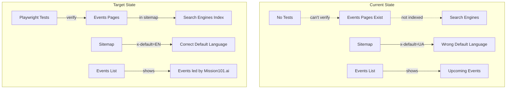
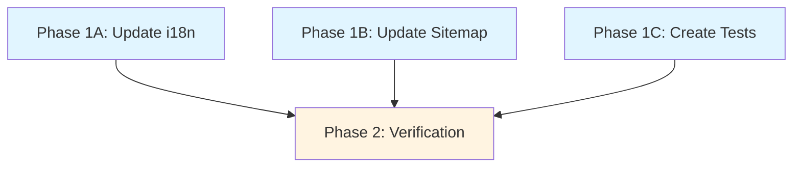

# Events Sitemap & Tests

## Current State

The events pages were recently added to the site with the following structure:

- Events list pages: `[/en/events](src/pages/EventsPage.tsx)` and `[/ua/events](src/pages/EventsPage.tsx)`
- Event detail pages: `[/en/events/:eventSlug](src/pages/EventDetailPage.tsx)` and `[/ua/events/:eventSlug](src/pages/EventDetailPage.tsx)`
- Currently one event: `uzhhorod-2026-03-18`

**Problems:**

1. **Missing from sitemap**: Events pages are not in `[public/sitemap.xml](public/sitemap.xml)`, so search engines won't discover them
2. **Wrong x-default logic**: All existing pages (except root) have `x-default` pointing to Ukrainian versions, should point to English for international audiences
3. **Incorrect heading**: Events list shows "Upcoming Events" / "Майбутні події" but should show "Events led by Mission101.ai" / "Події від Mission101.ai"
4. **No test coverage**: No Playwright tests exist for events pages

**Existing sitemap structure:**

- Static XML file at `[public/sitemap.xml](public/sitemap.xml)`
- Contains root pages, uzhhorod landing, and 6 service pages
- Uses hreflang alternates for en/uk with x-default fallback
- Maintained manually (no generation script)

**Existing test structure:**

- Playwright config at `[playwright.config.ts](playwright.config.ts)`
- Tests in `[e2e/](e2e/)` directory
- Patterns: `*.spec.ts` files with `test.describe()` groups
- Tests run against static build on port 8080

## Goal

Make events pages discoverable by search engines and ensure they work correctly by:

1. Adding events pages to sitemap with proper SEO metadata
2. Correcting x-default hreflang links across entire sitemap to point to English versions
3. Updating events heading text to better reflect Mission101.ai branding
4. Creating comprehensive Playwright tests for events functionality

## Architecture




## Key Decisions Summary


| Decision                   | Options Considered                       | Choice                       | Rationale                                                  |
| -------------------------- | ---------------------------------------- | ---------------------------- | ---------------------------------------------------------- |
| i18n text update           | Manual vs automated                      | Manual edit of JSON files    | Only 2 files, simple key change, no automation needed      |
| Sitemap x-default strategy | Keep UA, Switch to EN, Make configurable | Switch to EN                 | International standard to use English as fallback language |
| Events sitemap priority    | 0.7, 0.8, 0.9                            | 0.8 for list, 0.7 for detail | Match services (0.8), detail slightly lower (0.7)          |
| Test scope                 | Basic vs comprehensive                   | Basic (load + visibility)    | User requested basic tests, can expand later               |
| Parallel execution         | Sequential vs parallel                   | Parallel Phase 1             | No file conflicts: i18n, sitemap, tests are separate files |


## Dependency Graph




**Dependency Analysis:**

- **Phase 1 subagents are fully parallel**: No file conflicts
  - 1A modifies `src/i18n/locales/en.json` and `src/i18n/locales/ua.json`
  - 1B modifies `public/sitemap.xml`
  - 1C creates new file `e2e/events.spec.ts`
- **Phase 2 requires Phase 1 complete**: Tests need updated code, verification needs sitemap changes applied

## Execution Protocol

Follow the standard plan execution protocol:

1. **Master agent delegates all work** to subagents via Task tool
2. **Subagents never mark todos complete** - they report results back to master
3. **Master tracks progress** by updating YAML frontmatter before/after each subagent
4. **Parallel launch**: All Phase 1 subagents (1A, 1B, 1C) must be launched in a single message
5. **Verification is delegated**: Phase 2 shell subagent runs verification commands
6. **Human approval required**: After Phase 1 completes, present summary and wait for approval before Phase 2
7. **Phase gating**: Phase 2 cannot start until all Phase 1 todos are `completed`

## PHASE 1A -- Update i18n Events Heading (parallel with 1B, 1C)

**Goal**: Change events list heading from "Upcoming Events" to "Events led by Mission101.ai" in both English and Ukrainian.

**Subagent**: generalPurpose

**Inputs**: None (Phase 1)

**Tasks**:

1. Update `[src/i18n/locales/en.json](src/i18n/locales/en.json)` line 391
  - Change: `"upcoming": "Upcoming Events"`
  - To: `"upcoming": "Events led by Mission101.ai"`
2. Update `[src/i18n/locales/ua.json](src/i18n/locales/ua.json)` line 391
  - Change: `"upcoming": "Майбутні події"`
  - To: `"upcoming": "Події від Mission101.ai"`

**Files created/modified**:

- src/i18n/locales/en.json (modified)
- src/i18n/locales/ua.json (modified)

**Verification**:

```bash
# Verify JSON is still valid
cat src/i18n/locales/en.json | jq '.events.list.upcoming' | grep -q "Events led by Mission101.ai" && echo "EN: OK" || echo "EN: FAILED"
cat src/i18n/locales/ua.json | jq '.events.list.upcoming' | grep -q "Події від Mission101.ai" && echo "UA: OK" || echo "UA: FAILED"
```

## PHASE 1B -- Update Sitemap (parallel with 1A, 1C)

**Goal**: Fix x-default hreflang links to point to English versions and add events pages to sitemap.

**Subagent**: generalPurpose

**Inputs**: None (Phase 1)

**Tasks**:

1. Fix x-default links for 7 existing pages in `[public/sitemap.xml](public/sitemap.xml)`:
  - Line 37: `/ua/uzhhorod/` → `/en/uzhhorod/`
  - Line 55: `/ua/services/voice-agents/` → `/en/services/voice-agents/`
  - Line 73: `/ua/services/ai-assistants/` → `/en/services/ai-assistants/`
  - Line 91: `/ua/services/custom-ai-solutions/` → `/en/services/custom-ai-solutions/`
  - Line 109: `/ua/services/marketing-automation/` → `/en/services/marketing-automation/`
  - Line 127: `/ua/services/ai-websites/` → `/en/services/ai-websites/`
  - Line 145: `/ua/services/business-analytics/` → `/en/services/business-analytics/`
2. Add 4 new URL entries after line 155 (after business-analytics):
  - `/en/events/` with priority 0.8, x-default pointing to `/en/events/`
  - `/ua/events/` with priority 0.8, x-default pointing to `/en/events/`
  - `/en/events/uzhhorod-2026-03-18/` with priority 0.7, x-default pointing to `/en/events/uzhhorod-2026-03-18/`
  - `/ua/events/uzhhorod-2026-03-18/` with priority 0.7, x-default pointing to `/en/events/uzhhorod-2026-03-18/`
3. Set `lastmod` to `2026-03-21` for all new entries
4. Set `changefreq` to `monthly` for all new entries
5. Include hreflang alternates (en, uk, x-default) for each entry

**Structure template for new entries**:

```xml
<url>
  <loc>https://mission101.ai/en/events/</loc>
  <lastmod>2026-03-21</lastmod>
  <changefreq>monthly</changefreq>
  <priority>0.8</priority>
  <xhtml:link rel="alternate" hreflang="en" href="https://mission101.ai/en/events/" />
  <xhtml:link rel="alternate" hreflang="uk" href="https://mission101.ai/ua/events/" />
  <xhtml:link rel="alternate" hreflang="x-default" href="https://mission101.ai/en/events/" />
</url>
```

**Files created/modified**:

- public/sitemap.xml (modified)

**Verification**:

```bash
# Verify XML is well-formed
xmllint --noout public/sitemap.xml && echo "XML: VALID" || echo "XML: INVALID"

# Count x-default links pointing to /en/ (should be 14: 3 root + 1 uzhhorod + 6 services + 2 events list + 2 events detail)
grep -c 'x-default.*href="https://mission101.ai/en/' public/sitemap.xml

# Verify events pages exist in sitemap
grep -q "mission101.ai/en/events/" public/sitemap.xml && echo "Events in sitemap: OK" || echo "Events missing"
```

## PHASE 1C -- Create Playwright Tests (parallel with 1A, 1B)

**Goal**: Create comprehensive Playwright tests for events list and detail pages covering basic functionality.

**Subagent**: generalPurpose

**Inputs**: None (Phase 1)

**Tasks**:

1. Create `[e2e/events.spec.ts](e2e/events.spec.ts)` following existing test patterns from `[e2e/seo-tags.spec.ts](e2e/seo-tags.spec.ts)` and `[e2e/i18n-routing.spec.ts](e2e/i18n-routing.spec.ts)`
2. Include test groups:
  - **Events List Page Tests**:
    - `/en/events` loads without 404 (status 200)
    - `/ua/events` loads without 404 (status 200)
    - Events hero section is visible
    - Events list component is visible
    - Page has #root element visible
  - **Event Detail Page Tests**:
    - `/en/events/uzhhorod-2026-03-18` loads without 404
    - `/ua/events/uzhhorod-2026-03-18` loads without 404
    - Event hero section is visible
    - Event details section is visible
    - Event CTA section is visible
  - **Navigation Flow Test**:
    - Can navigate from events list to event detail
    - URL changes correctly
    - Event detail content loads after navigation
3. Use test patterns:
  - `import { test, expect } from '@playwright/test'`
  - `test.describe()` for grouping
  - `page.goto()` followed by status check
  - `await expect(page.locator()).toBeVisible()` for content verification
  - `page.waitForLoadState('networkidle')` when needed

**Files created/modified**:

- e2e/events.spec.ts (new)

**Verification**:

```bash
# Verify test file syntax
npx tsc --noEmit e2e/events.spec.ts && echo "TypeScript: OK" || echo "TypeScript: ERRORS"

# Count test cases (should have at least 8 tests)
grep -c "test('" e2e/events.spec.ts
```

## PHASE 2 -- Verification

**Goal**: Verify all changes work correctly by running tests and checking sitemap validity.

**Subagent**: shell

**Inputs**: Phase 1A, 1B, 1C (all must be completed)

**Tasks**:

1. Verify sitemap XML validity
2. Check x-default link count is correct
3. Build the site
4. Run Playwright tests including new events tests
5. Report any failures

**Files created/modified**:

- None (verification only)

**Verification**:

```bash
# Verify sitemap
xmllint --noout public/sitemap.xml && echo "✓ Sitemap XML valid"

# Check x-default count (should be 18 total: 3 root + 1 uzhhorod + 6 services + 2 events list + 2 events detail = 14 with /en/)
X_DEFAULT_COUNT=$(grep -c 'x-default.*href="https://mission101.ai/en/' public/sitemap.xml)
echo "✓ x-default links to English: $X_DEFAULT_COUNT (expected: 14)"

# Verify events in sitemap
grep -q "mission101.ai/en/events/" public/sitemap.xml && echo "✓ Events pages in sitemap"

# Verify i18n changes
grep -q '"upcoming": "Events led by Mission101.ai"' src/i18n/locales/en.json && echo "✓ EN i18n updated"
grep -q '"upcoming": "Події від Mission101.ai"' src/i18n/locales/ua.json && echo "✓ UA i18n updated"

# Build site
npm run build

# Run Playwright tests
npm run test -- e2e/events.spec.ts

# Success criteria: All tests pass
echo "✓ All verifications complete"
```

