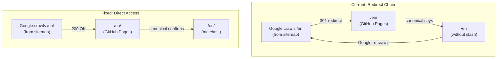

# Fix Google Search Console Indexing Issues

## Root Cause Analysis

Your site is a Vite + React SPA deployed to **GitHub Pages**. GitHub Pages has a specific behavior: when a URL like `/en` maps to a directory (`en/`) containing an `index.html`, it automatically **301 redirects** `/en` to `/en/` (adding a trailing slash). Your sitemap, canonical tags, and hreflang links all use URLs **without** trailing slashes, which conflicts with what GitHub Pages actually serves.

---

## Issue 1: "Page with redirect" (3 pages)

| URL | Cause |
| --- | ----- |

- `**https://mission101.ai/en`** -- GitHub Pages 301 redirects to `/en/` because `en/` is a directory. The sitemap lists `/en` (no slash), so Google follows a redirect.
- `**http://mission101.ai/`** -- Standard HTTP to HTTPS redirect. This is **expected and harmless** -- no fix needed.
- `**https://mission101.ai/ua`** -- Same as `/en` -- GitHub Pages 301 redirects `/ua` to `/ua/`.

**Fix**: Update all URLs in the sitemap to use trailing slashes so Google arrives at the final URL directly, with no redirect.

---

## Issue 2: "Alternative page with proper canonical tag" (2 pages)

- `**https://mission101.ai/en/`** -- Google arrives here after redirect from `/en`. The page's canonical points to `/en` (without slash). Google sees the trailing-slash version as an "alternate" of the canonical.
- `**https://mission101.ai/ua/uzhhorod/`** -- Same pattern. Canonical points to `/ua/uzhhorod`.

**Fix**: Update canonical tags to use trailing-slash URLs, matching what GitHub Pages actually serves. This means updating:

1. Static HTML canonical tags in all `index.html` files
2. The `SEO.tsx` component to stop stripping trailing slashes
3. Hreflang links everywhere

---

## Issue 3: "Crawled - currently not indexed" (2 pages)

- `**https://mission101.ai/mission101-icon.ico`** -- Referenced in HTML `<link>` tags but **no `.ico` file exists in the repository** (confirmed: zero `.ico` files found via glob). It may exist only in the deployed `dist/` or is missing entirely.
- `**https://mission101.ai/favicon.ico`** -- Browsers auto-request `/favicon.ico` by convention. No such file exists. If it 404s, the `404.html` SPA redirect kicks in, sending Google to the homepage -- confusing the crawler.

**Fix**: Add a `favicon.ico` file to `public/` as a copy of `mission101-icon.ico`. This ensures browsers and Google's crawler find the standard `/favicon.ico` path directly instead of hitting a 404 that triggers the SPA redirect.

---

## Issue 4: "Discovered - currently not indexed" (1 page)

- `**https://mission101.ai/en/uzhhorod`** -- Listed in the sitemap but **never crawled** (Last crawled: N/A). Google discovered the URL via the sitemap but hasn't prioritized crawling it. The redirect from `/en/uzhhorod` to `/en/uzhhorod/` may be contributing.

**Fix**: Will likely resolve once trailing-slash URLs are used consistently in the sitemap and canonical tags. The redirect chain currently discourages Google from indexing. You can also request indexing manually in GSC after the fixes.

---

## Files to Change

### 1. [public/sitemap.xml](public/sitemap.xml) -- Add trailing slashes to all `<loc>` and `<xhtml:link href>` URLs

- `/en` becomes `/en/`, `/ua` becomes `/ua/`, etc.
- Root `/` stays as `/` (no change needed)

### 2. [src/components/SEO.tsx](src/components/SEO.tsx) -- Stop stripping trailing slashes

- Line 33: `const normalizedPath = currentPath.replace(/\/$/, '') || '/';` currently removes trailing slashes
- Change to preserve trailing slashes for directory-like paths
- Update hreflang generation (lines 101-114) to use trailing-slash URLs

### 3. Static HTML files -- Update canonical and hreflang to use trailing slashes

- [index.html](index.html) (root -- no change needed, canonical is already `/`)
- [public/en/index.html](public/en/index.html) -- canonical `https://mission101.ai/en/`
- [public/ua/index.html](public/ua/index.html) -- canonical `https://mission101.ai/ua/`
- [public/en/uzhhorod/index.html](public/en/uzhhorod/index.html) -- canonical `https://mission101.ai/en/uzhhorod/`
- [public/ua/uzhhorod/index.html](public/ua/uzhhorod/index.html) -- canonical `https://mission101.ai/ua/uzhhorod/`
- All service page `index.html` files under `public/en/services/*/` and `public/ua/services/*/`

### 4. Favicon files -- Add `favicon.ico` to `public/`

- Copy `mission101-icon.ico` to `public/favicon.ico` so crawlers find the conventional `/favicon.ico` path
- Verify `.ico` files are committed to the repo (currently zero `.ico` files found -- they may need to be un-gitignored or regenerated)

---

## Architecture of the Problem

