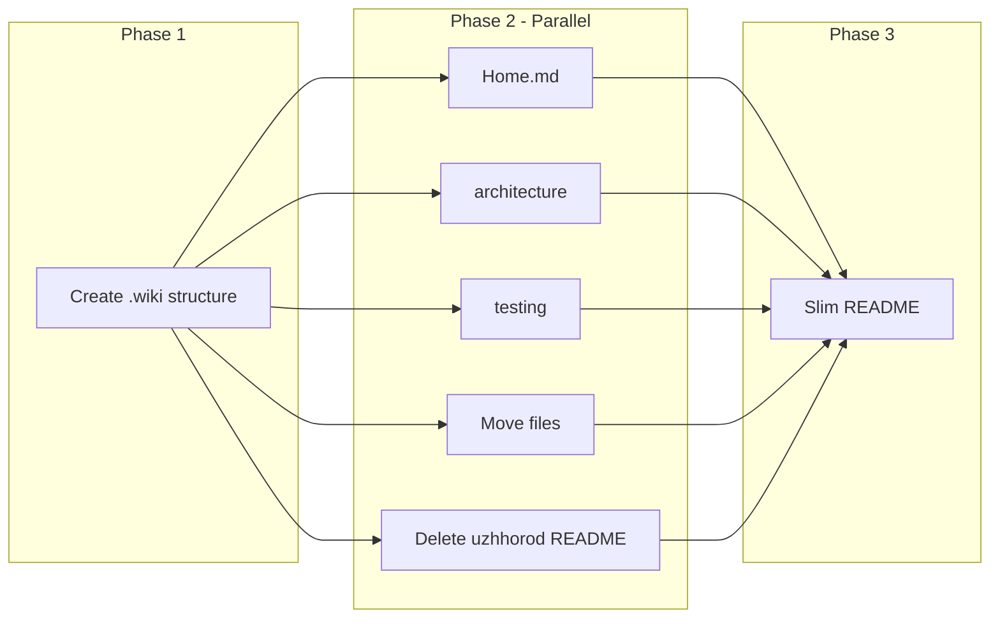

# Instructions to .wiki Migration Plan

## Execution Model: Multiagent Parallel




**Launch order:** Phase 1 (1 agent) → Phase 2 (5 agents in parallel) → Phase 3 (1 agent).

**mcp_task prompts (Phase 2, run in parallel):**

- Agent A: "Create .wiki/Home.md with TOC linking to architecture/overview.md, testing/overview.md, deployment/github-pages.md, seo/setup.md, seo/i18n-routing.md, seo/uzhhorod.md, assets/favicon.md"
- Agent B: "Create .wiki/architecture/overview.md from README and codebase: project structure, routing, i18n, build, config"
- Agent C: "Create .wiki/testing/overview.md from README and e2e/: test suites, coverage, commands, CI"
- Agent D: "Move instructions/*.md to .wiki/ per mapping in .cursor/plans/instructions_to_wiki_migration.plan.md, delete empty instructions/"
- Agent E: "Delete public/uzhhorod/README.md"

---

## Phase 1: Bootstrap (1 agent)

**Blocking:** Must complete before Phase 2. Create `.wiki/` with subdirs: `architecture/`, `testing/`, `deployment/`, `seo/`, `assets/`. No files yet.

---

## Phase 2: Parallel Tasks (5 agents)

### Agent A: Home.md

Create `.wiki/Home.md` with TOC linking to: architecture/overview.md, testing/overview.md, deployment/github-pages.md, seo/setup.md, seo/i18n-routing.md, seo/uzhhorod.md, assets/favicon.md.

### Agent B: architecture/overview.md

Create `.wiki/architecture/overview.md`. Content: project structure, routing (App.tsx), i18n flow, build process (vite.config.ts), key config. Ref: `src/App.tsx`, `vite.config.ts`, README.

### Agent C: testing/overview.md

Create `.wiki/testing/overview.md`. Content: test suites (i18n-routing, seo-tags, uzhhorod-page), coverage, commands, CI. Ref: `e2e/*.spec.ts`, `.github/workflows/deploy.yml`, README.

### Agent D: Move instructions files


| From                                 | To                               |
| ------------------------------------ | -------------------------------- |
| instructions/DEPLOYMENT.md           | .wiki/deployment/github-pages.md |
| instructions/FAVICON-SETUP.md        | .wiki/assets/favicon.md          |
| instructions/SEO-SETUP.md            | .wiki/seo/setup.md               |
| instructions/SEO-I18N-ROUTING.md     | .wiki/seo/i18n-routing.md        |
| instructions/UZHHOROD-SEO-SUMMARY.md | .wiki/seo/uzhhorod.md            |


Delete empty `instructions/` after moves.

### Agent E: Delete uzhhorod README

Delete `public/uzhhorod/README.md`. No replacement. Folder stays for images.

---

## Phase 3: README Cleanup (1 agent)

Slim `README.md`. Remove: Deployment Process (213-228), Configuration (229-243), SEO Features (246-275), Testing details (108-132), i18n details (134-157), Project Structure (161-204). Replace with brief summaries + links to `.wiki/`. Update Documentation section. Remove stale links (UZHHOROD-IMAGE-PROMPTS, UZHHOROD-PAGE-SUMMARY).

---

## .wiki Structure (reference)

```
.wiki/
├── Home.md
├── architecture/
│   └── overview.md
├── testing/
│   └── overview.md
├── deployment/
│   └── github-pages.md
├── seo/
│   ├── setup.md
│   ├── i18n-routing.md
│   └── uzhhorod.md
└── assets/
    └── favicon.md
```

