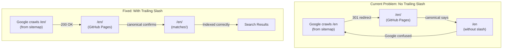

# Restore Trailing Slashes for GitHub Pages SEO

## Context

GitHub Pages automatically 301 redirects directory-based URLs from `/en` to `/en/` (with trailing slash). The previous GSC indexing fix correctly added trailing slashes to match this behavior and avoid redirect chains. However, the recent fix to pass E2E tests removed these trailing slashes, which will reintroduce the GSC indexing issues.

## Solution

Revert the SEO.tsx changes to restore trailing slashes and update the E2E tests to match production behavior (GitHub Pages with trailing slashes).

## Changes Required

### 1. Revert [src/components/SEO.tsx](src/components/SEO.tsx)

**Line 32-33**: Restore trailing slash addition for directory-like paths

Current (incorrect):

```tsx
// Normalize path - remove trailing slashes for canonical URLs (SEO best practice)
const normalizedPath = currentPath === '/' ? '/' : currentPath.replace(/\/$/, '');
```

Change to:

```tsx
// Normalize path - add trailing slashes for directory-like paths (matches GitHub Pages behavior)
const normalizedPath = currentPath === '/' ? '/' : (currentPath.endsWith('/') ? currentPath : currentPath + '/');
```

**Lines 101-114**: Restore trailing slashes to all hreflang URLs

Current (incorrect):

```tsx
// Update hreflang based on page type (no trailing slashes for SEO best practice)
if (isServicePage && serviceSlug) {
  updateAlternateLink('en', `${baseUrl}/en/services/${serviceSlug}`);
  updateAlternateLink('uk', `${baseUrl}/ua/services/${serviceSlug}`);
  updateAlternateLink('x-default', `${baseUrl}/ua/services/${serviceSlug}`);
} else if (isLocalPage || normalizedPath.includes('/uzhhorod')) {
  updateAlternateLink('en', `${baseUrl}/en/uzhhorod`);
  updateAlternateLink('uk', `${baseUrl}/ua/uzhhorod`);
  updateAlternateLink('x-default', `${baseUrl}/ua/uzhhorod`);
} else {
  updateAlternateLink('en', `${baseUrl}/en`);
  updateAlternateLink('uk', `${baseUrl}/ua`);
  updateAlternateLink('x-default', baseUrl);
}
```

Change to:

```tsx
// Update hreflang based on page type (use trailing slashes to match GitHub Pages behavior)
if (isServicePage && serviceSlug) {
  updateAlternateLink('en', `${baseUrl}/en/services/${serviceSlug}/`);
  updateAlternateLink('uk', `${baseUrl}/ua/services/${serviceSlug}/`);
  updateAlternateLink('x-default', `${baseUrl}/ua/services/${serviceSlug}/`);
} else if (isLocalPage || normalizedPath.includes('/uzhhorod')) {
  updateAlternateLink('en', `${baseUrl}/en/uzhhorod/`);
  updateAlternateLink('uk', `${baseUrl}/ua/uzhhorod/`);
  updateAlternateLink('x-default', `${baseUrl}/ua/uzhhorod/`);
} else {
  updateAlternateLink('en', `${baseUrl}/en/`);
  updateAlternateLink('uk', `${baseUrl}/ua/`);
  updateAlternateLink('x-default', baseUrl);
}
```

### 2. Update [e2e/seo-tags.spec.ts](e2e/seo-tags.spec.ts)

Update all test assertions to expect trailing slashes:

**Line 17**: `/en` canonical URL test

```typescript
expect(canonical).toBe('https://mission101.ai/en/');
```

**Line 25**: `/ua` canonical URL test

```typescript
expect(canonical).toBe('https://mission101.ai/ua/');
```

**Line 33**: Trailing slash normalization test - update to verify trailing slash is preserved

```typescript
expect(canonical).toBe('https://mission101.ai/en/');
expect(canonical).toMatch(/\/$/); // Should end with trailing slash
```

**Line 46**: hreflang tags test

```typescript
expect(enLink).toBe('https://mission101.ai/en/');
```

**Line 50**: Ukrainian hreflang

```typescript
expect(ukLink).toBe('https://mission101.ai/ua/');
```

### 3. Update [e2e/uzhhorod-page.spec.ts](e2e/uzhhorod-page.spec.ts)

Update Uzhhorod page SEO tests to expect trailing slashes:

**Line 69**: Ukrainian canonical URL

```typescript
expect(canonical).toBe('https://mission101.ai/ua/uzhhorod/');
```

**Line 76**: English canonical URL

```typescript
expect(canonical).toBe('https://mission101.ai/en/uzhhorod/');
```

**Line 83**: English hreflang

```typescript
expect(enLink).toBe('https://mission101.ai/en/uzhhorod/');
```

**Line 86**: Ukrainian hreflang

```typescript
expect(ukLink).toBe('https://mission101.ai/ua/uzhhorod/');
```

**Line 89**: x-default hreflang

```typescript
expect(defaultLink).toBe('https://mission101.ai/ua/uzhhorod/');
```

### 4. Update [instructions/SEO-SETUP.md](instructions/SEO-SETUP.md)

Add a new section explaining the trailing slash strategy after the "SEO Best Practices Implemented" section (after line 155):

```markdown
## URL Structure and Trailing Slashes

### GitHub Pages Behavior

This site is deployed to GitHub Pages, which has specific URL handling behavior:

- Directory-based routes like `/en` or `/ua/uzhhorod` are served from `en/index.html` and `ua/uzhhorod/index.html`
- GitHub Pages automatically **301 redirects** URLs without trailing slashes to versions with trailing slashes
  - `/en` redirects to `/en/`
  - `/ua/uzhhorod` redirects to `/ua/uzhhorod/`
- The root URL `/` does not redirect (no trailing slash added)

### SEO Strategy: Trailing Slashes

To avoid redirect chains that harm SEO and confuse search engine crawlers, all canonical URLs and hreflang links use **trailing slashes** to match GitHub Pages' final URL format:

**Canonical URLs:**
- `https://mission101.ai/` (root - no trailing slash)
- `https://mission101.ai/en/` (with trailing slash)
- `https://mission101.ai/ua/` (with trailing slash)
- `https://mission101.ai/en/uzhhorod/` (with trailing slash)
- `https://mission101.ai/en/services/automation/` (with trailing slash)

**Why This Matters:**

Without trailing slashes, Google Search Console reports:
1. "Page with redirect" - Google finds the URL in sitemap but hits a 301 redirect
2. "Alternative page with proper canonical tag" - The redirected page's canonical points to a different URL (without slash)

This creates a redirect loop that prevents proper indexing.

**Implementation:**

The `SEO.tsx` component automatically adds trailing slashes to all paths except the root:

```tsx
const normalizedPath = currentPath === '/' ? '/' : (currentPath.endsWith('/') ? currentPath : currentPath + '/');
```

All hreflang alternate links also use trailing slashes to ensure consistency across all SEO tags.

### Testing

E2E tests in `e2e/seo-tags.spec.ts` and `e2e/uzhhorod-page.spec.ts` verify that:

- Canonical URLs include trailing slashes (except root)
- Hreflang links include trailing slashes
- All SEO tags match the GitHub Pages URL structure

This ensures tests match production behavior and catch any regressions.

```

## Architecture Diagram



## Verification Steps

After implementing changes:

1. Run E2E tests: `npm test`
2. Verify all 61 tests pass
3. Run production build: `npm run build`
4. Verify build succeeds with no errors
5. Check that SEO.tsx generates trailing slashes in canonical and hreflang tags

