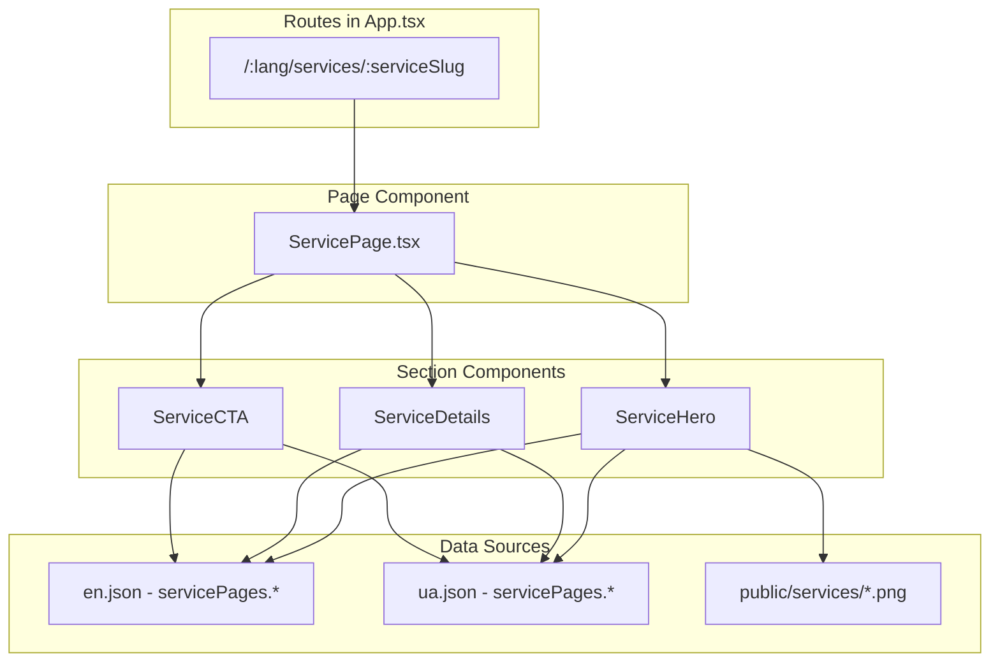
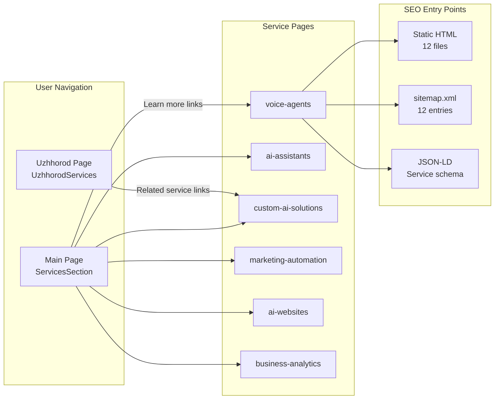
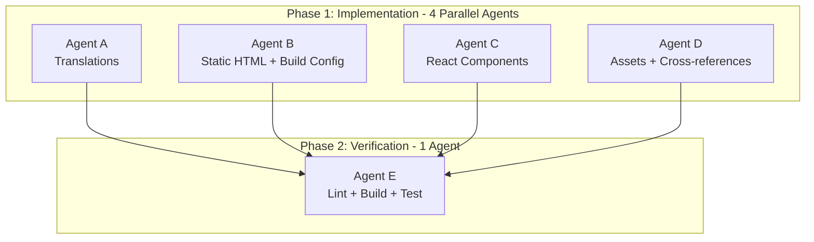

# Service Pages Implementation Plan

## Overview

Create 6 dedicated service pages for mission101.ai, following the established Uzhhorod sub-page pattern. Each service gets its own page at `/{lang}/services/{slug}`, fully localized in English and Ukrainian, with proper SEO, structured data, static HTML for crawlers, and cross-references from the main page and Uzhhorod page.

## Services and URL Slugs


| #   | Service (UA)                       | Service (EN)                      | Slug                   | Image          |
| --- | ---------------------------------- | --------------------------------- | ---------------------- | -------------- |
| 1   | Голосові помічники для кол-центрів | Voice Agents for Call Centers     | `voice-agents`         | `service1.png` |
| 2   | Персональні цифрові помічники      | Personal AI Assistants            | `ai-assistants`        | `service2.png` |
| 3   | Індивідуальні ШІ-рішення           | Custom AI Solutions               | `custom-ai-solutions`  | `service3.png` |
| 4   | Автоматизація маркетингу           | Marketing Automation              | `marketing-automation` | `service4.png` |
| 5   | Створення сайтів із ШІ             | AI-Generated Websites             | `ai-websites`          | `service5.png` |
| 6   | Моніторинг та аналітика            | Business Monitoring and Analytics | `business-analytics`   | `service6.png` |


## Architecture Decision

Use a **single parameterized `ServicePage.tsx` component** with React Router's `:serviceSlug` param, rather than 6 separate page files. The component reads the slug, maps it to a service index, and renders the content from translations. This follows the DRY principle and scales easily.




## File Changes

### 1. Move and Organize Images

- Copy `tmp/service1.png` through `tmp/service6.png` to `public/services/` with descriptive names:
  - `public/services/voice-agents.png`
  - `public/services/ai-assistants.png`
  - `public/services/custom-ai-solutions.png`
  - `public/services/marketing-automation.png`
  - `public/services/ai-websites.png`
  - `public/services/business-analytics.png`

### 2. Translation Files

Add a `servicePages` section to both `[src/i18n/locales/en.json](src/i18n/locales/en.json)` and `[src/i18n/locales/ua.json](src/i18n/locales/ua.json)`.

Each service entry will contain:

- `slug` - URL slug
- `title` - page heading
- `subtitle` - short tagline
- `description` - extended description from Services.md
- `features` - array of 4 key features/characteristics from Services.md
- `seo.title` - SEO page title
- `seo.description` - SEO meta description
- `cta` - call-to-action text

Example structure for one service in `en.json`:

```json
"servicePages": {
  "backToServices": "Back to Services",
  "ctaTitle": "Ready to Get Started?",
  "ctaButton": "Schedule a Consultation",
  "items": [
    {
      "slug": "voice-agents",
      "title": "Voice Agents for Call Centers",
      "subtitle": "AI-powered conversational agents for 24/7 customer service",
      "description": "Intelligent voice assistants help businesses automatically answer customer calls, provide consultations, accept requests, and deliver basic information without operator involvement. They understand natural language, can conduct full conversations, and work around the clock without breaks or days off. This reduces staff workload, cuts costs, and improves customer service quality.",
      "features": [
        "24/7 availability",
        "Natural language understanding",
        "Integration with internal systems",
        "Reduced staffing costs"
      ],
      "seo": {
        "title": "Voice Agents for Call Centers | Mission101.ai",
        "description": "AI-powered voice agents for call centers. 24/7 availability, natural language understanding, integration with your systems. Reduce costs and improve customer service."
      }
    }
  ]
}
```

Ukrainian translations will use the expanded descriptions from [tmp/Services.md](tmp/Services.md).

### 3. Page Component: `[src/pages/ServicePage.tsx](src/pages/ServicePage.tsx)` (new)

Following the Uzhhorod pattern from `[src/pages/Uzhhorod.tsx](src/pages/Uzhhorod.tsx)`:

```tsx
const ServicePage = () => {
  const { serviceSlug } = useParams();
  // Map slug to service index, scroll to top on mount
  // Render: SEO + UzhhorodNav + ServiceHero + ServiceDetails + ServiceCTA + FooterSection
};
```

- Uses `useParams()` to get `:serviceSlug`
- Maps slug to service index in translations
- Redirects to 404 if slug is invalid
- Uses `light-theme` class like Uzhhorod page

### 4. Section Components (new files in `src/components/sections/`)

- `**ServiceHero.tsx**` - Hero banner with service image, title, subtitle, and breadcrumb navigation back to main page services section. Uses the corresponding `public/services/{slug}.png` image.
- `**ServiceDetails.tsx**` - Extended description and features list. Shows the full description text and the 4 feature characteristics in a styled grid (similar to `UzhhorodLocalAdvantages` pattern).
- `**ServiceCTA.tsx**` - Call-to-action section with contact button (links to `/#contact`), similar to `[src/components/sections/UzhhorodCTA.tsx](src/components/sections/UzhhorodCTA.tsx)`.

### 5. Routing: `[src/App.tsx](src/App.tsx)`

Add parameterized routes before the catch-all:

```tsx
import ServicePage from "./pages/ServicePage";
// ...
<Route path="/en/services/:serviceSlug" element={<ServicePage />} />
<Route path="/en/services/:serviceSlug/" element={<ServicePage />} />
<Route path="/ua/services/:serviceSlug" element={<ServicePage />} />
<Route path="/ua/services/:serviceSlug/" element={<ServicePage />} />
```

### 6. SEO Component: `[src/components/SEO.tsx](src/components/SEO.tsx)`

Extend to support service pages:

- Add `isServicePage?: boolean` prop
- When `isServicePage` is true, inject `Service` JSON-LD structured data (service name, description, provider, area served)
- Set appropriate hreflang alternates for service pages (`/en/services/{slug}` <-> `/ua/services/{slug}`)

### 7. Static HTML Files for Search Engines

Create 12 static HTML files (6 services x 2 languages):

- `public/en/services/voice-agents/index.html`
- `public/ua/services/voice-agents/index.html`
- `public/en/services/ai-assistants/index.html`
- `public/ua/services/ai-assistants/index.html`
- ... (same pattern for all 6 slugs)

Each file follows the pattern of `[public/en/uzhhorod/index.html](public/en/uzhhorod/index.html)`:

- Correct `lang` attribute
- Service-specific `<title>`, `<meta description>`, `<link canonical>`
- Language alternates (hreflang)
- Open Graph and Twitter Card tags
- Service JSON-LD structured data
- Google Analytics tags
- Resource hints and font loading
- SPA redirect script and dev script tag for Vite injection

### 8. Vite Config: `[vite.config.ts](vite.config.ts)`

Update the `copy-index-to-lang-folders` plugin to also process all 6 service directories for both languages. Add a loop that iterates over the service slugs array and creates `dist/en/services/{slug}/` and `dist/ua/services/{slug}/` directories, reading from `public/en/services/{slug}/index.html` and injecting production assets.

### 9. Sitemap: `[public/sitemap.xml](public/sitemap.xml)`

Add 12 new URL entries (6 services x 2 languages) with:

- `<loc>` for each service page URL
- `<lastmod>` set to current date
- `<changefreq>monthly</changefreq>`
- `<priority>0.8</priority>`
- Proper `xhtml:link` hreflang alternates pointing between EN/UA versions

### 10. Main Page Service Links: `[src/components/sections/ServicesSection.tsx](src/components/sections/ServicesSection.tsx)`

Make each service card clickable, linking to the corresponding service page:

- Import `useLanguage` to get current language
- Add a "Learn more" link or wrap the card in a `<Link>` to `/{lang}/services/{slug}`
- Map service index to slug using a constant array
- Maintain existing design while adding the navigation affordance

### 11. Uzhhorod Page References: `[src/components/sections/UzhhorodServices.tsx](src/components/sections/UzhhorodServices.tsx)`

Add "Learn more" links from the Uzhhorod services section to the relevant service detail pages. The 4 Uzhhorod services (Business Process Automation, Cost Optimization, Custom AI Solutions, Performance Enhancement) don't directly map 1:1 to the 6 main services, so we'll link to the most relevant service page for each. At minimum, "Custom AI Solutions" from Uzhhorod maps to `custom-ai-solutions`.

### 12. Navigation Consideration

The existing `UzhhorodNav` (logo + language switcher) will be reused for service pages, consistent with the sub-page pattern. No new navigation component is needed -- the breadcrumb in `ServiceHero` provides the "back to main" path.

## Data Flow




## Execution Strategy: Phases and Subagents

### Dependency Analysis

All implementation tasks operate on **separate files** with zero conflicts:

- `en.json`, `ua.json` -- only touched by translations
- `ServicePage.tsx`, `ServiceHero.tsx`, `ServiceDetails.tsx`, `ServiceCTA.tsx` -- new files
- `App.tsx`, `SEO.tsx` -- each only touched by one task
- `ServicesSection.tsx`, `UzhhorodServices.tsx` -- each only touched by one task
- `vite.config.ts`, `sitemap.xml` -- each only touched by one task
- 12 static HTML files -- all new files
- 6 image files -- simple copies

This means **all implementation work can run in a single parallel phase**, followed by a verification phase.




---

### Phase 1: Implementation (4 parallel agents)

#### Agent A -- "Translations" (generalPurpose)

**Files:** `src/i18n/locales/en.json`, `src/i18n/locales/ua.json`

**Tasks:**

- Add `servicePages` section to `en.json` with all 6 services (slug, title, subtitle, description, features, SEO meta)
- Add `servicePages` section to `ua.json` with all 6 services (Ukrainian content from Services.md)

**Workload:** Large -- 2 files, extensive content for 6 services x 2 languages

**Context needed:** Current en.json and ua.json contents, Services.md for Ukrainian descriptions, SEO metadata reference table below

---

#### Agent B -- "Static HTML and Build Config" (generalPurpose)

**Files:**

- 12 new: `public/{en,ua}/services/{slug}/index.html` (6 slugs x 2 languages)
- Edit: `public/sitemap.xml`
- Edit: `vite.config.ts`

**Tasks:**

- Create 12 static HTML files following the `public/en/uzhhorod/index.html` template, with service-specific SEO meta, JSON-LD Service schema, hreflang alternates
- Add 12 URL entries to sitemap.xml
- Update vite.config.ts `closeBundle` plugin to loop over service slugs and create `dist/{en,ua}/services/{slug}/` directories

**Workload:** Large -- 12 new files (templated) + 2 edits

**Context needed:** `public/en/uzhhorod/index.html` as template, current `sitemap.xml`, current `vite.config.ts`, SEO metadata reference table below

---

#### Agent C -- "React Components and Routing" (generalPurpose)

**Files:**

- 4 new: `src/pages/ServicePage.tsx`, `src/components/sections/ServiceHero.tsx`, `src/components/sections/ServiceDetails.tsx`, `src/components/sections/ServiceCTA.tsx`
- Edit: `src/App.tsx` (add 4 routes)
- Edit: `src/components/SEO.tsx` (add `isServicePage` support)

**Tasks:**

- Create `ServicePage.tsx` -- parameterized page component using `useParams()`, maps slug to service index, composes sections
- Create `ServiceHero.tsx` -- hero with image, title, subtitle, breadcrumb back to `/#services`
- Create `ServiceDetails.tsx` -- full description + 4-feature grid
- Create `ServiceCTA.tsx` -- call-to-action with link to `/#contact`
- Add 4 parameterized routes to `App.tsx`
- Extend `SEO.tsx` with `isServicePage` prop for Service JSON-LD and correct hreflang

**Workload:** Large -- 4 new components + 2 edits, most complex logic

**Context needed:** `Uzhhorod.tsx` and `UzhhorodHero.tsx`, `UzhhorodCTA.tsx` as design patterns, current `App.tsx`, current `SEO.tsx`, `UzhhorodNav.tsx` for reuse, translation key structure from plan

---

#### Agent D -- "Assets and Cross-references" (generalPurpose)

**Files:**

- 6 new: `public/services/{slug}.png` (image copies)
- Edit: `src/components/sections/ServicesSection.tsx`
- Edit: `src/components/sections/UzhhorodServices.tsx`

**Tasks:**

- Copy 6 images from `tmp/` to `public/services/` with descriptive filenames
- Update `ServicesSection.tsx` -- make cards clickable with `<Link>` to `/{lang}/services/{slug}`, add "Learn more" affordance
- Update `UzhhorodServices.tsx` -- add "Learn more" links to the closest matching service pages

**Workload:** Medium -- 6 file copies + 2 existing file edits

**Context needed:** Current `ServicesSection.tsx`, current `UzhhorodServices.tsx`, slug list, `useLanguage` hook pattern from `LanguageContext.tsx`

---

### Phase 2: Verification (1 agent, after Phase 1 completes)

#### Agent E -- "Build Verification" (shell)

**Tasks:**

1. Run `npx eslint` on all modified/new files to check for lint errors
2. Run `npm run build` to verify production build succeeds
3. Spot-check that `dist/` contains all expected service directories
4. Optionally run `npm run test` to verify existing E2E tests still pass

---

### Service Metadata Reference

This table provides the canonical SEO data that Agents A and B must use consistently:

**EN SEO Titles and Descriptions:**

- `voice-agents`
  - Title: "Voice Agents for Call Centers | Mission101.ai"
  - Description: "AI-powered voice agents for call centers. 24/7 availability, natural language understanding, seamless integration with your systems. Reduce costs and improve customer service."
- `ai-assistants`
  - Title: "Personal AI Assistants for Business | Mission101.ai"
  - Description: "Intelligent AI assistants that automate scheduling, document preparation, and daily workflows. Save time and boost efficiency for your team."
- `custom-ai-solutions`
  - Title: "Custom AI Solutions for Your Business | Mission101.ai"
  - Description: "Bespoke AI solutions tailored to your business needs. Sales forecasting, request processing automation, data analysis, and internal process optimization."
- `marketing-automation`
  - Title: "AI Marketing Automation | Mission101.ai"
  - Description: "AI-powered marketing automation tools. Automated content creation, audience analysis, budget optimization, and real-time performance tracking."
- `ai-websites`
  - Title: "AI-Generated Business Websites | Mission101.ai"
  - Description: "Modern websites built with AI technology. Personalized content, built-in assistants, mobile-responsive design, and seamless integration with your systems."
- `business-analytics`
  - Title: "Business Monitoring and Analytics | Mission101.ai"
  - Description: "Real-time business analytics and monitoring. Track key metrics, identify risks early, get automated reports, and make data-driven decisions."

**UA SEO Titles and Descriptions:**

- `voice-agents`
  - Title: "Голосові помічники для кол-центрів | Mission101.ai"
  - Description: "Інтелектуальні голосові помічники на основі ШІ для кол-центрів. Цілодобова робота, розуміння природної мови, інтеграція з вашими системами. Зменшення витрат та покращення обслуговування."
- `ai-assistants`
  - Title: "Персональні цифрові помічники для бізнесу | Mission101.ai"
  - Description: "Цифрові ШІ-помічники для автоматизації щоденних завдань. Планування зустрічей, підготовка документів, організація робочих процесів. Економія часу та підвищення ефективності."
- `custom-ai-solutions`
  - Title: "Індивідуальні рішення зі штучного інтелекту | Mission101.ai"
  - Description: "Розробка ШІ-рішень під потреби вашого бізнесу. Прогнозування продажів, автоматизація обробки звернень, аналіз даних та оптимізація внутрішніх процесів."
- `marketing-automation`
  - Title: "Автоматизація маркетингу з ШІ | Mission101.ai"
  - Description: "Інструменти автоматизації маркетингу на основі ШІ. Створення рекламних матеріалів, аналіз аудиторії, оптимізація витрат та відстеження результатів."
- `ai-websites`
  - Title: "Створення сайтів із використанням ШІ | Mission101.ai"
  - Description: "Сучасні сайти, створені за допомогою штучного інтелекту. Персоналізований вміст, вбудовані онлайн-помічники, адаптація до мобільних пристроїв та інтеграція з вашими системами."
- `business-analytics`
  - Title: "Моніторинг та аналітика бізнесу | Mission101.ai"
  - Description: "Системи аналітики бізнесу в реальному часі. Контроль ключових показників, виявлення ризиків, автоматичні звіти та прийняття рішень на основі даних."

---

### Uzhhorod-to-Service Slug Mapping

For Agent D when updating `UzhhorodServices.tsx`:

- Uzhhorod item 0 "Business Process Automation" --> `voice-agents` (closest: automation focus)
- Uzhhorod item 1 "Cost Optimization" --> `business-analytics` (closest: analytics/monitoring)
- Uzhhorod item 2 "Custom AI Solutions" --> `custom-ai-solutions` (direct match)
- Uzhhorod item 3 "Performance Enhancement" --> `marketing-automation` (closest: performance/optimization)

---

## Testing Considerations

After implementation, existing E2E tests should still pass. New tests could be added for:

- Route accessibility for all 12 service URLs
- SEO tag validation (titles, descriptions, canonical, hreflang)
- Service page content rendering
- Language switching on service pages
- Navigation back to main page

