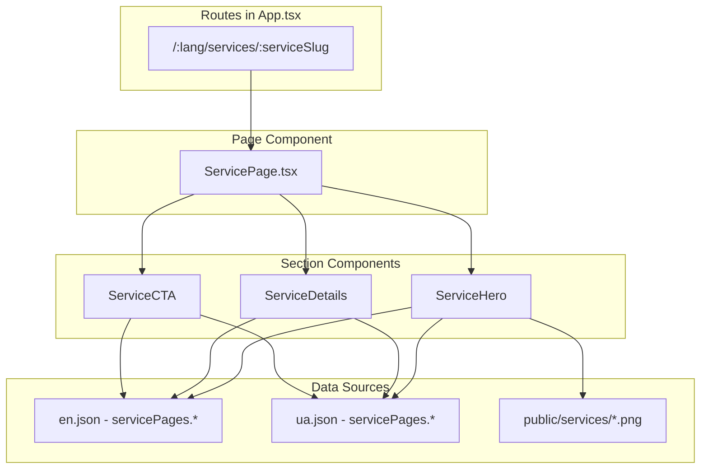
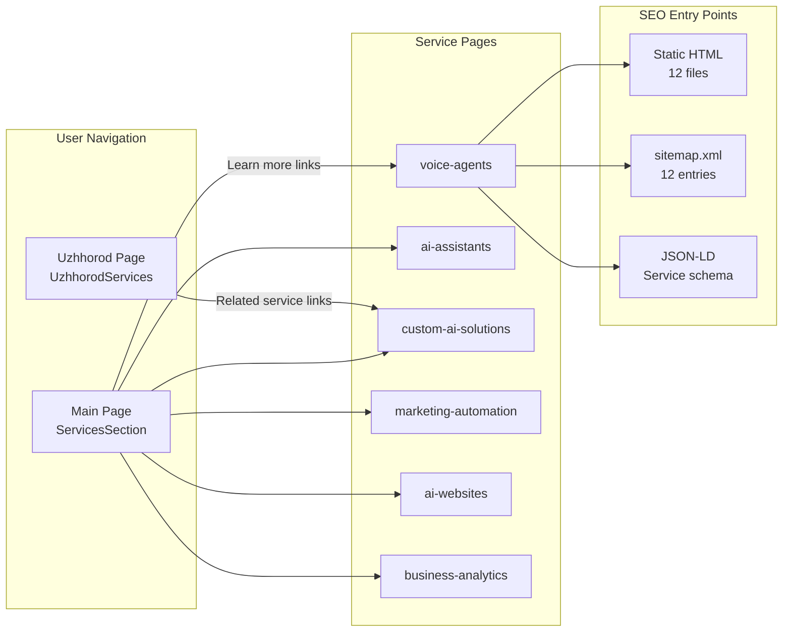

# Service Pages Implementation Plan

## Overview

Create 6 dedicated service pages for mission101.ai, following the established Uzhhorod sub-page pattern. Each service gets its own page at `/{lang}/services/{slug}`, fully localized in English and Ukrainian, with proper SEO, structured data, static HTML for crawlers, and cross-references from the main page and Uzhhorod page.

## Services and URL Slugs


| #   | Service (UA)                       | Service (EN)                      | Slug                   | Image          |
| --- | ---------------------------------- | --------------------------------- | ---------------------- | -------------- |
| 1   | Голосові помічники для кол-центрів | Voice Agents for Call Centers     | `voice-agents`         | `service1.png` |
| 2   | Персональні цифрові помічники      | Personal AI Assistants            | `ai-assistants`        | `service2.png` |
| 3   | Індивідуальні ШІ-рішення           | Custom AI Solutions               | `custom-ai-solutions`  | `service3.png` |
| 4   | Автоматизація маркетингу           | Marketing Automation              | `marketing-automation` | `service4.png` |
| 5   | Створення сайтів із ШІ             | AI-Generated Websites             | `ai-websites`          | `service5.png` |
| 6   | Моніторинг та аналітика            | Business Monitoring and Analytics | `business-analytics`   | `service6.png` |


## Architecture Decision

Use a **single parameterized `ServicePage.tsx` component** with React Router's `:serviceSlug` param, rather than 6 separate page files. The component reads the slug, maps it to a service index, and renders the content from translations. This follows the DRY principle and scales easily.




## File Changes

### 1. Move and Organize Images

- Copy `tmp/service1.png` through `tmp/service6.png` to `public/services/` with descriptive names:
  - `public/services/voice-agents.png`
  - `public/services/ai-assistants.png`
  - `public/services/custom-ai-solutions.png`
  - `public/services/marketing-automation.png`
  - `public/services/ai-websites.png`
  - `public/services/business-analytics.png`

### 2. Translation Files

Add a `servicePages` section to both `[src/i18n/locales/en.json](src/i18n/locales/en.json)` and `[src/i18n/locales/ua.json](src/i18n/locales/ua.json)`.

Each service entry will contain:

- `slug` - URL slug
- `title` - page heading
- `subtitle` - short tagline
- `description` - extended description from Services.md
- `features` - array of 4 key features/characteristics from Services.md
- `seo.title` - SEO page title
- `seo.description` - SEO meta description
- `cta` - call-to-action text

Example structure for one service in `en.json`:

```json
"servicePages": {
  "backToServices": "Back to Services",
  "ctaTitle": "Ready to Get Started?",
  "ctaButton": "Schedule a Consultation",
  "items": [
    {
      "slug": "voice-agents",
      "title": "Voice Agents for Call Centers",
      "subtitle": "AI-powered conversational agents for 24/7 customer service",
      "description": "Intelligent voice assistants help businesses automatically answer customer calls, provide consultations, accept requests, and deliver basic information without operator involvement. They understand natural language, can conduct full conversations, and work around the clock without breaks or days off. This reduces staff workload, cuts costs, and improves customer service quality.",
      "features": [
        "24/7 availability",
        "Natural language understanding",
        "Integration with internal systems",
        "Reduced staffing costs"
      ],
      "seo": {
        "title": "Voice Agents for Call Centers | Mission101.ai",
        "description": "AI-powered voice agents for call centers. 24/7 availability, natural language understanding, integration with your systems. Reduce costs and improve customer service."
      }
    }
  ]
}
```

Ukrainian translations will use the expanded descriptions from [tmp/Services.md](tmp/Services.md).

### 3. Page Component: `[src/pages/ServicePage.tsx](src/pages/ServicePage.tsx)` (new)

Following the Uzhhorod pattern from `[src/pages/Uzhhorod.tsx](src/pages/Uzhhorod.tsx)`:

```tsx
const ServicePage = () => {
  const { serviceSlug } = useParams();
  // Map slug to service index, scroll to top on mount
  // Render: SEO + UzhhorodNav + ServiceHero + ServiceDetails + ServiceCTA + FooterSection
};
```

- Uses `useParams()` to get `:serviceSlug`
- Maps slug to service index in translations
- Redirects to 404 if slug is invalid
- Uses `light-theme` class like Uzhhorod page

### 4. Section Components (new files in `src/components/sections/`)

- `**ServiceHero.tsx**` - Hero banner with service image, title, subtitle, and breadcrumb navigation back to main page services section. Uses the corresponding `public/services/{slug}.png` image.
- `**ServiceDetails.tsx**` - Extended description and features list. Shows the full description text and the 4 feature characteristics in a styled grid (similar to `UzhhorodLocalAdvantages` pattern).
- `**ServiceCTA.tsx**` - Call-to-action section with contact button (links to `/#contact`), similar to `[src/components/sections/UzhhorodCTA.tsx](src/components/sections/UzhhorodCTA.tsx)`.

### 5. Routing: `[src/App.tsx](src/App.tsx)`

Add parameterized routes before the catch-all:

```tsx
import ServicePage from "./pages/ServicePage";
// ...
<Route path="/en/services/:serviceSlug" element={<ServicePage />} />
<Route path="/en/services/:serviceSlug/" element={<ServicePage />} />
<Route path="/ua/services/:serviceSlug" element={<ServicePage />} />
<Route path="/ua/services/:serviceSlug/" element={<ServicePage />} />
```

### 6. SEO Component: `[src/components/SEO.tsx](src/components/SEO.tsx)`

Extend to support service pages:

- Add `isServicePage?: boolean` prop
- When `isServicePage` is true, inject `Service` JSON-LD structured data (service name, description, provider, area served)
- Set appropriate hreflang alternates for service pages (`/en/services/{slug}` <-> `/ua/services/{slug}`)

### 7. Static HTML Files for Search Engines

Create 12 static HTML files (6 services x 2 languages):

- `public/en/services/voice-agents/index.html`
- `public/ua/services/voice-agents/index.html`
- `public/en/services/ai-assistants/index.html`
- `public/ua/services/ai-assistants/index.html`
- ... (same pattern for all 6 slugs)

Each file follows the pattern of `[public/en/uzhhorod/index.html](public/en/uzhhorod/index.html)`:

- Correct `lang` attribute
- Service-specific `<title>`, `<meta description>`, `<link canonical>`
- Language alternates (hreflang)
- Open Graph and Twitter Card tags
- Service JSON-LD structured data
- Google Analytics tags
- Resource hints and font loading
- SPA redirect script and dev script tag for Vite injection

### 8. Vite Config: `[vite.config.ts](vite.config.ts)`

Update the `copy-index-to-lang-folders` plugin to also process all 6 service directories for both languages. Add a loop that iterates over the service slugs array and creates `dist/en/services/{slug}/` and `dist/ua/services/{slug}/` directories, reading from `public/en/services/{slug}/index.html` and injecting production assets.

### 9. Sitemap: `[public/sitemap.xml](public/sitemap.xml)`

Add 12 new URL entries (6 services x 2 languages) with:

- `<loc>` for each service page URL
- `<lastmod>` set to current date
- `<changefreq>monthly</changefreq>`
- `<priority>0.8</priority>`
- Proper `xhtml:link` hreflang alternates pointing between EN/UA versions

### 10. Main Page Service Links: `[src/components/sections/ServicesSection.tsx](src/components/sections/ServicesSection.tsx)`

Make each service card clickable, linking to the corresponding service page:

- Import `useLanguage` to get current language
- Add a "Learn more" link or wrap the card in a `<Link>` to `/{lang}/services/{slug}`
- Map service index to slug using a constant array
- Maintain existing design while adding the navigation affordance

### 11. Uzhhorod Page References: `[src/components/sections/UzhhorodServices.tsx](src/components/sections/UzhhorodServices.tsx)`

Add "Learn more" links from the Uzhhorod services section to the relevant service detail pages. The 4 Uzhhorod services (Business Process Automation, Cost Optimization, Custom AI Solutions, Performance Enhancement) don't directly map 1:1 to the 6 main services, so we'll link to the most relevant service page for each. At minimum, "Custom AI Solutions" from Uzhhorod maps to `custom-ai-solutions`.

### 12. Navigation Consideration

The existing `UzhhorodNav` (logo + language switcher) will be reused for service pages, consistent with the sub-page pattern. No new navigation component is needed -- the breadcrumb in `ServiceHero` provides the "back to main" path.

## Data Flow




## Testing Considerations

After implementation, existing E2E tests should still pass. New tests could be added for:

- Route accessibility for all 12 service URLs
- SEO tag validation (titles, descriptions, canonical, hreflang)
- Service page content rendering
- Language switching on service pages
- Navigation back to main page

